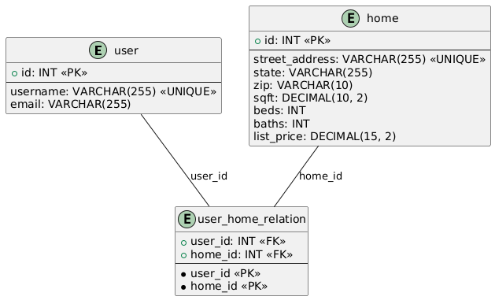

# Solution

## Thought Process

The initial problem involves a denormalized `user_home` table, which stores both user-related information (username, email) and home-related attributes (street_address, state, zip, sqft, beds, baths, list_price). This structure leads to data redundancy and inconsistency since each user can be related to multiple homes, and each home can be related to multiple users (a **many-to-many relationship**). My goal is to refactor the database into a normalized structure while maintaining the relationship between users and homes.

### Steps Involved in Refactoring:

1. **Creating `user` table**:
   - Extracted `username` and `email` from the `user_home` table.
   - Each user is uniquely identified by `username`, but to ensure proper referencing, I have assigned an auto-incrementing primary key `id` to this table.
   - This table now stores all user-related information, reducing redundancy.

2. **Creating `home` table**:
   - Extracted home-related columns such as `street_address`, `state`, `zip`, `sqft`, `beds`, `baths`, and `list_price` from the `user_home` table.
   - Each home is uniquely identified by `street_address`. To properly reference homes, I have assigned an auto-incrementing primary key `id` to this table.
   - The `home` table will now store all home-related information.

3. **Creating `user_home_relation` table**:
   - This table represents the many-to-many relationship between `user` and `home`.
   - It consists of two foreign keys:
     - `user_id` referencing the `user.id` column.
     - `home_id` referencing the `home.id` column.
   - The combination of `user_id` and `home_id` acts as a composite primary key for this table, ensuring that each user-home relationship is unique.
   - This structure ensures data normalization and enforces proper referential integrity.
  
#### ERD Diagram


### Explanation of Entities

- **User Entity**:
   - This entity represents individual users and consists of attributes such as `username` and `email`.
   - The `id` is an auto-incremented primary key, uniquely identifying each user.
   - Each user can be related to multiple homes through the `user_home_relation` table.

````
import { Entity, PrimaryGeneratedColumn, Column, ManyToMany, JoinTable } from 'typeorm';
import { Home } from './Home';

@Entity('user')
export class User {
  @PrimaryGeneratedColumn()
  id: number;

  @Column({ unique: true, type: 'varchar', length: 255 })
  username: string;

  @Column({ type: 'varchar', length: 255 })
  email: string;

  @ManyToMany(() => Home, home => home.users)
  @JoinTable({
    name: 'user_home_relation', // This is the name of the join table
    joinColumn: { name: 'user_id', referencedColumnName: 'id' },
    inverseJoinColumn: { name: 'home_id', referencedColumnName: 'id' }
  })
  homes: Home[];
}

````
  


- **Home Entity**:
   - This entity represents homes and consists of attributes such as `street_address`, `state`, `zip`, `sqft`, `beds`, `baths`, and `list_price`.
   - The `id` is an auto-incremented primary key, uniquely identifying each home.
   - Each home can be related to multiple users through the `user_home_relation` table.

````
import { Entity, PrimaryGeneratedColumn, Column, ManyToMany } from 'typeorm';
import { User } from './User';

@Entity('home')
export class Home {
  @PrimaryGeneratedColumn()
  id: number;

  @Column({ unique: true, type: 'varchar', length: 255 })
  street_address: string;

  @Column({ type: 'varchar', length: 255 })
  state: string;

  @Column({ type: 'varchar', length: 10 })
  zip: string;

  @Column({ type: 'decimal', precision: 10, scale: 2 })
  sqft: number;

  @Column({ type: 'int' })
  beds: number;

  @Column({ type: 'int' })
  baths: number;

  @Column({ type: 'decimal', precision: 15, scale: 2 })
  list_price: number;

  @ManyToMany(() => User, user => user.homes)
  users: User[];
}

````

- **User-Home Relationship Entity (`user_home_relation`)**:
   - This entity represents the many-to-many relationship between users and homes.
   - It consists of two foreign keys:
     - `user_id`, which references the `user` entity.
     - `home_id`, which references the `home` entity.
   - The combination of `user_id` and `home_id` forms the composite primary key, ensuring a unique relationship between each user and home.

### SQL Script

The final SQL script is present in the `sql` folder with the name `99_final_db_dump.sql`. This script will:

1. Create the `user`, `home`, and `user_home_relation` tables.
2. Insert unique users and homes from the `user_home` table into their respective tables.
3. Populate the `user_home_relation` table to establish the many-to-many relationships between users and homes.

